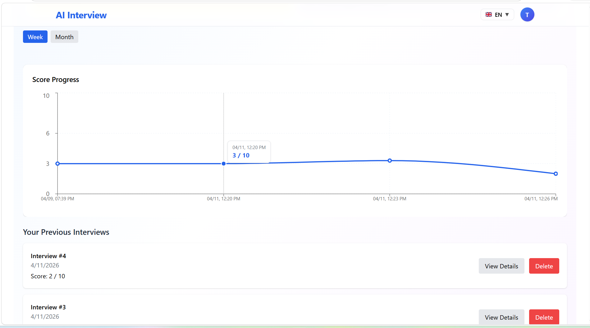
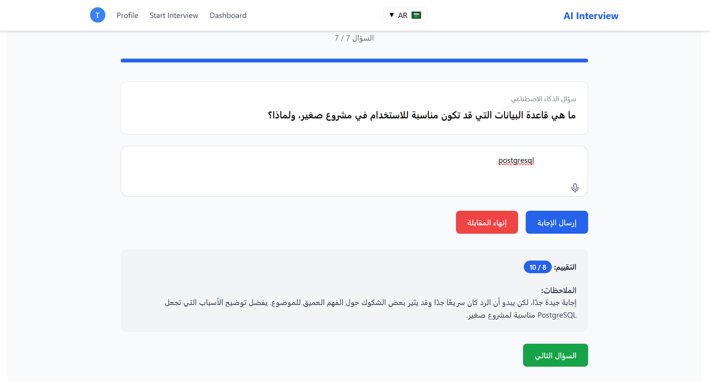
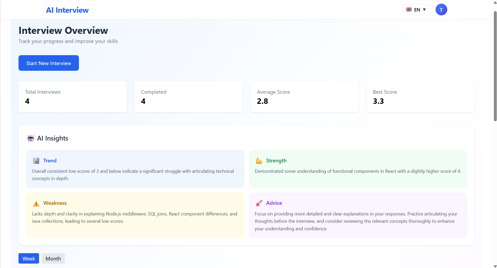

# 🧠 Adaptive AI Interview Simulator

An advanced AI-powered platform that simulates real technical interviews with dynamic question generation, intelligent evaluation, and personalized feedback.

Built to replicate real-world interview experiences using adaptive logic, voice input, and AI-driven insights.

---

## 🚀 Features

### 🤖 AI Interview Engine
- Generates interview questions dynamically based on:
  - User level
  - Selected role (e.g. Backend, Frontend)
  - Tech stack (e.g. Node.js, React)
  - User language
- Evaluates answers using AI with:
  - Score (1–10)
  - Detailed feedback
  - Intelligent follow-up questions

---

### 🔁 Adaptive Interview Flow
- Each answer influences the next question
- AI decides:
  - Follow-up question (if answer is weak/incomplete)
  - Next-level question (if answer is strong)
- Real-time difficulty adjustment

---

### ⏱️ Timed Interview System
- Each question has a **2-minute time limit**
- If time expires:
  - The system automatically moves to the next question
- Simulates real interview pressure and timing constraints

---

### 🎤 Voice Support
- Users can answer using voice input
- Simulates real interview conditions

---

### 🧠 AI Insights & Analytics
- Smart performance analysis based on:
  - Weekly / Monthly activity
- Provides detailed insights including:
  - 📈 Overall trend (progress over time)
  - ⚠️ Weaknesses
  - 💪 Strengths
  - 💡 Personalized improvement advice
- Helps users understand and improve their performance

---

### 📊 Dashboard & Interview History
- Performance dashboard with charts 📊
- Track all previous interviews
- View:
  - Scores
  - Answers
  - AI feedback
- Detailed breakdown per interview
- Each interview generates a new analysis
- Monitor performance over time

---

### 🌍 Multi-language Support
- Supports:
  - English 
  - French 
  - Arabic 
- Smart AI-based translation:
  - Questions adapt to selected language
  - Answers evaluated correctly regardless of language
  - Dynamic translation when user switches language

---

### 🔐 Authentication & Security
- JWT-based authentication
- Secure user sessions
- Protected routes
- Input validation for email and password
- Basic password strength requirements (minimum length, uppercase, number)

---

### 🚫 Anti-Cheating System
- Detects copy-paste behavior
- Tracks abnormal response patterns
- Encourages authentic answers

---

### ⚙️ Personalized Interview Setup
Each interview is customized based on:
- User level
- Selected role
- Tech stack
- Language preference

---

## 🛠 Tech Stack

- **Backend:** Node.js, Express  
- **Database:** PostgreSQL  
- **ORM:** Prisma  
- **AI Integration:** OpenAI API  
- **Authentication:** JWT  
- **Frontend:** (React,vite)  

---

## 🌐 Live Demo

👉 https://ai-interview-simulator-teal.vercel.app

---

## 🧩 How It Works

1. User logs in and selects interview settings  
2. AI generates a tailored question  
3. User answers (text or voice)  
4. Each question has a 2-minute timer  
5. AI evaluates the answer  
6. System:
   - Generates follow-up OR next-level question  
7. If time expires, the system automatically moves forward  
8. Results are stored and analyzed  
9. User can review full interview history and insights  

---

## 📸 Screenshots

### Dashboard

### Interview UI

### AI Insights

---

## 📈 Key Highlights

- Real-time adaptive interview system  
- AI-driven evaluation and feedback  
- Multi-language intelligent support  
- Voice-based interaction  
- Performance analytics & tracking  
- Anti-cheating detection  
- Timed interview simulation  

---

